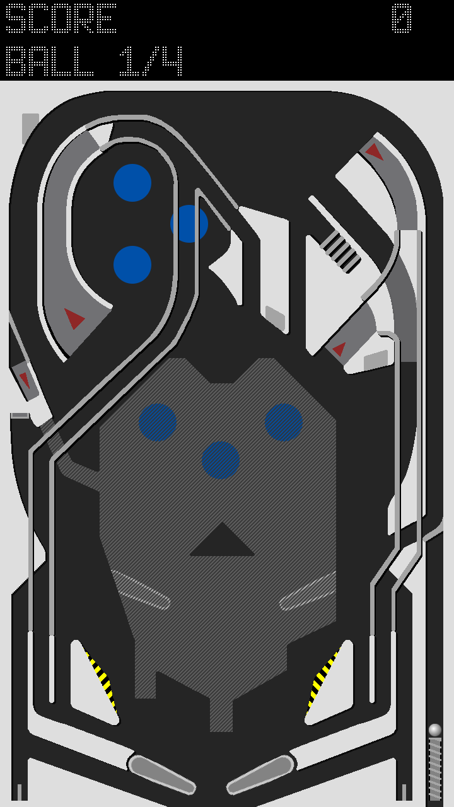

# PinballNX
A homebrew pinball game for the nintendo switch.

Take the joycons off and turn the display to portrait.

## Controls
### Switch
- Flippers: L and R
- Pull Plunger: Either Stick Down
- Pause: Minus
- New Game: B
- Quit: Plus

### Desktop
- Flippers: S and D
- Pull Plunger: Down Arrow
- Pause: Space
- New Game: W
- Quit: Enter

## Building

See [BUILDING.md](./BUILDING.md).

## Credits

- Libcross2d
  - Cpajuste [libcross2d](https://github.com/Cpasjuste/libcross2d)
- Box2D
  - Erin Catto [Box2D](https://github.com/erincatto/Box2D)
- Scoreboard Font: Advanced Dot Digital-7
  - Sizenko Alexander [Style-7](http://www.styleseven.com)
