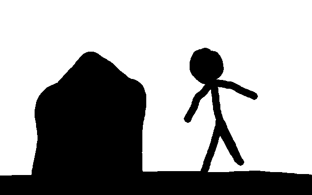

This folder contains scripts to convert bitmap images into paths for use with Box2D. 
If you're developing a Box2D game, you might find this useful and are welcome to use it for free ([LICENSE.md](../LICENSE.md)).

### Dependencies
Install [potrace](http://potrace.sourceforge.net/) and [python](https://www.python.org/)

    sudo apt install potrace python

### Usage for creating outline
Supply `myimage.bmp` as bmp image that contains only black or white pixels (no gray) and is a single closed figure (concave and convex both supported).

    ./imgtopoints.sh myimage.bmp

The output is a list of pairs of points separated by commas, but not grouped into pairs. The intended use of the output is to create a float array in a C++ file.

    float[38] circle = {250, 293, -35, -18, -13, -37, -14, -37, 18, -38, 19, -38, 36, -13, 36, -14, 37, 16, 37, 15, 15, 36, 15, 37, -11, 34, -12, 35, -21, 14, -22, 14, -25, 6, -25, 5, -35, -17};

A function can then read the float values out of the array in pairs of 2 and use them as x, y coordinates for constructing a chain shape. The points can also be used for creating a [ConvexShape](https://www.sfml-dev.org/documentation/2.5.1/classsf_1_1ConvexShape.php) in SFML for graphics. 

Example input:

Example output:

    250, 293, -35, -18, -13, -37, -14, -37, 18, -38, 19, -38, 36, -13, 36, -14, 37, 16, 37, 15, 15, 36, 15, 37, -11, 34, -12, 35, -21, 14, -22, 14, -25, 6, -25, 5, -35, -17,

### Usage for creating triangles
TODO: Decomposing the polygon into triangles expressed as groups of 3 pairs of x, y coordinates defnining triangles. 